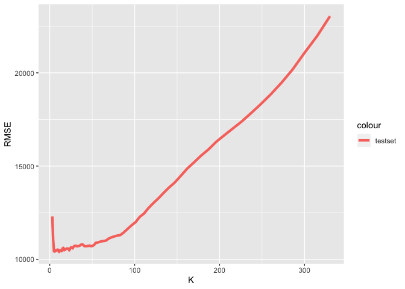
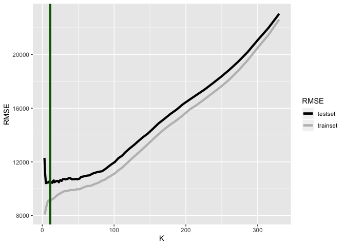
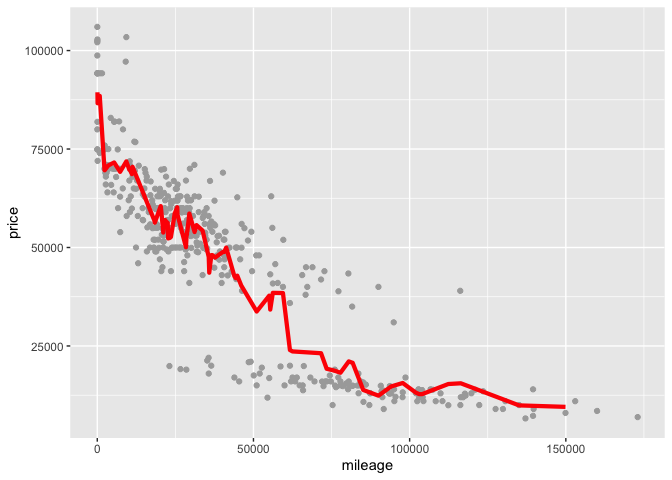
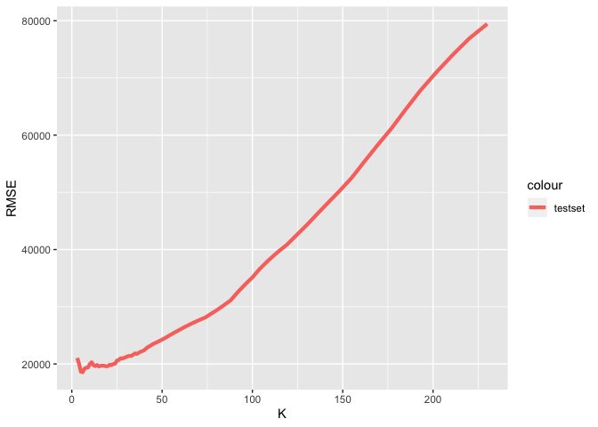
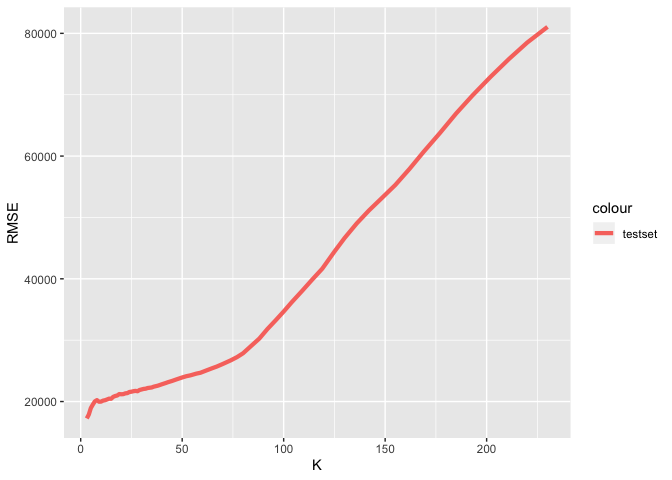
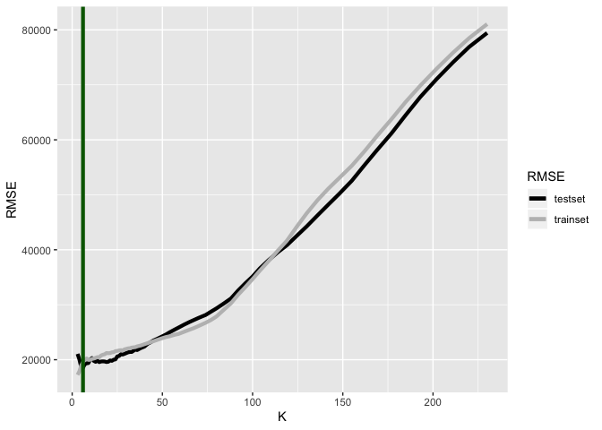
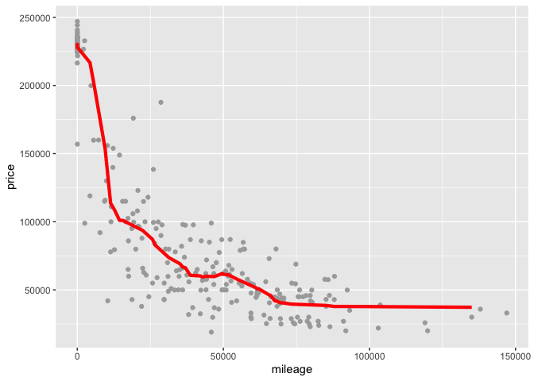

Exercise1-2 XuechunWang
================

# trim level 350

``` r
library(mosaic)
```

    ## Loading required package: dplyr

    ## 
    ## Attaching package: 'dplyr'

    ## The following objects are masked from 'package:stats':
    ## 
    ##     filter, lag

    ## The following objects are masked from 'package:base':
    ## 
    ##     intersect, setdiff, setequal, union

    ## Loading required package: lattice

    ## Loading required package: ggformula

    ## Loading required package: ggplot2

    ## Loading required package: ggstance

    ## 
    ## Attaching package: 'ggstance'

    ## The following objects are masked from 'package:ggplot2':
    ## 
    ##     geom_errorbarh, GeomErrorbarh

    ## 
    ## New to ggformula?  Try the tutorials: 
    ##  learnr::run_tutorial("introduction", package = "ggformula")
    ##  learnr::run_tutorial("refining", package = "ggformula")

    ## Loading required package: mosaicData

    ## Loading required package: Matrix

    ## Registered S3 method overwritten by 'mosaic':
    ##   method                           from   
    ##   fortify.SpatialPolygonsDataFrame ggplot2

    ## 
    ## The 'mosaic' package masks several functions from core packages in order to add 
    ## additional features.  The original behavior of these functions should not be affected by this.
    ## 
    ## Note: If you use the Matrix package, be sure to load it BEFORE loading mosaic.

    ## 
    ## Attaching package: 'mosaic'

    ## The following object is masked from 'package:Matrix':
    ## 
    ##     mean

    ## The following object is masked from 'package:ggplot2':
    ## 
    ##     stat

    ## The following objects are masked from 'package:dplyr':
    ## 
    ##     count, do, tally

    ## The following objects are masked from 'package:stats':
    ## 
    ##     binom.test, cor, cor.test, cov, fivenum, IQR, median,
    ##     prop.test, quantile, sd, t.test, var

    ## The following objects are masked from 'package:base':
    ## 
    ##     max, mean, min, prod, range, sample, sum

``` r
library(readr)
sclass <- read_csv("sclass.csv")
```

    ## Parsed with column specification:
    ## cols(
    ##   id = col_double(),
    ##   trim = col_character(),
    ##   subTrim = col_character(),
    ##   condition = col_character(),
    ##   isOneOwner = col_logical(),
    ##   mileage = col_double(),
    ##   year = col_double(),
    ##   color = col_character(),
    ##   displacement = col_character(),
    ##   fuel = col_character(),
    ##   state = col_character(),
    ##   region = col_character(),
    ##   soundSystem = col_character(),
    ##   wheelType = col_character(),
    ##   wheelSize = col_character(),
    ##   featureCount = col_double(),
    ##   price = col_double()
    ## )

``` r
sclass350 = subset(sclass, trim== '350')
sclass65AMG = subset(sclass, trim== '65 AMG')

library(tidyverse)
```

    ## ── Attaching packages ───────────────────────────────────────── tidyverse 1.2.1 ──

    ## ✔ tibble  2.1.3     ✔ purrr   0.3.2
    ## ✔ tidyr   0.8.3     ✔ stringr 1.4.0
    ## ✔ tibble  2.1.3     ✔ forcats 0.4.0

    ## ── Conflicts ──────────────────────────────────────────── tidyverse_conflicts() ──
    ## ✖ mosaic::count()            masks dplyr::count()
    ## ✖ purrr::cross()             masks mosaic::cross()
    ## ✖ mosaic::do()               masks dplyr::do()
    ## ✖ tidyr::expand()            masks Matrix::expand()
    ## ✖ dplyr::filter()            masks stats::filter()
    ## ✖ ggstance::geom_errorbarh() masks ggplot2::geom_errorbarh()
    ## ✖ dplyr::lag()               masks stats::lag()
    ## ✖ mosaic::stat()             masks ggplot2::stat()
    ## ✖ mosaic::tally()            masks dplyr::tally()

``` r
library(FNN)
library(foreach)
```

    ## 
    ## Attaching package: 'foreach'

    ## The following objects are masked from 'package:purrr':
    ## 
    ##     accumulate, when

``` r
ggplot(data = sclass350) + 
  geom_point(mapping = aes(x = mileage, y = price), color='darkgrey')
```

<!-- -->

# trim level 350: out of sample RMSE versus K

``` r
N1 = nrow(sclass350)
N_train1 = floor(0.8*N1)
N_test1 = N1 - N_train1

train_ind1 = sample.int(N1, N_train1, replace=FALSE)

D_train1 = sclass350[train_ind1,]
D_test1 = sclass350[-train_ind1,]

D_test1 = arrange(D_test1, mileage)

X_train1 = select(D_train1, mileage)
y_train1 = select(D_train1, price)
X_test1 = select(D_test1, mileage)
y_test1 = select(D_test1, price)

rmse = function(y, ypred) {
  sqrt(mean(data.matrix((y-ypred)^2)))
}

k_grid1_1 = unique(round(exp(seq(log(330), log(3), length=100))))
rmse_grid_out1 = foreach(k = k_grid1_1, .combine='c') %do% {
  knn_model1_1 = knn.reg(X_train1, X_test1, as.data.frame(y_train1), k = k)
  rmse(y_test1, knn_model1_1$pred)
}

rmse_grid_out1 = data.frame(K = k_grid1_1, RMSE = rmse_grid_out1)

p_out = ggplot(data=rmse_grid_out1) + 
  geom_path(aes(x=K, y=RMSE, color='testset'), size=1.5)
p_out
```

<!-- -->

``` r
ind_best = which.min(rmse_grid_out1$RMSE)
k_best = k_grid1_1[ind_best]
k_best
```

    ## [1] 11

# trim level 350: RMSE versus K

``` r
k_grid1_2 = unique(round(exp(seq(log(330), log(3), length=100))))
rmse_grid_in1 = foreach(k = k_grid1_2, .combine='c') %do% {
  knn_model1_2 = knn.reg(X_train1, X_train1, as.data.frame(y_train1), k = k)
  rmse(y_train1, knn_model1_2$pred)
}

rmse_grid_in1 = data.frame(K = k_grid1_2, RMSE = rmse_grid_in1)
ggplot(data=rmse_grid_in1) + 
  geom_path(aes(x=K, y=RMSE, color='testset'), size=1.5) 
```

<!-- -->

# trim level 350: RMSE(2 types) versus K

``` r
p_out + geom_path(data=rmse_grid_in1, aes(x=K, y=RMSE, color='trainset'),size=1.5) + 
  scale_colour_manual(name="RMSE",
                      values=c(testset="black", trainset="grey")) + 
  geom_vline(xintercept=k_best, color='darkgreen', size=1.5)
```

<!-- --> \[
optimal K = 8
\] trim level 350: K-nearest neighbors at the optimal K
========================================================

``` r
knn_model_optimal = knn.reg(X_train1, X_test1, as.data.frame(y_train1), k = 8)
d_test1 = data.frame(X_test1, ypred = knn_model_optimal$pred)
p_base1 = ggplot(data = sclass350) + 
  geom_point(mapping = aes(x =mileage , y = price), color='darkgrey') 

p_base1 + geom_path(data=d_test1, mapping = aes(x = mileage, y = ypred), color='red', size=1.5)
```

<!-- -->

# trim level 65AMG

``` r
ggplot(data = sclass65AMG) + 
  geom_point(mapping = aes(x = mileage, y = price), color='darkgrey') 
```

<!-- -->

# trim level 65AMG: out of sample RMSE versus K

``` r
N2 = nrow(sclass65AMG)
N_train2 = floor(0.8*N2)
N_test2 = N2 - N_train2

train_ind2 = sample.int(N2, N_train2, replace=FALSE)

D_train2 = sclass65AMG[train_ind2,]
D_test2 = sclass65AMG[-train_ind2,]

D_test2 = arrange(D_test2, mileage)

X_train2 = select(D_train2, mileage)
y_train2 = select(D_train2, price)
X_test2 = select(D_test2, mileage)
y_test2 = select(D_test2, price)

rmse = function(y, ypred) {
  sqrt(mean(data.matrix((y-ypred)^2)))
}

k_grid2_1 = unique(round(exp(seq(log(230), log(3), length=100))))
rmse_grid_out2 = foreach(k = k_grid2_1, .combine='c') %do% {
  knn_model2_1 = knn.reg(X_train2, X_test2,as.data.frame( y_train2), k = k)
  rmse(y_test2, knn_model2_1$pred)
}

rmse_grid_out2 = data.frame(K = k_grid2_1, RMSE = rmse_grid_out2)

p_out = ggplot(data=rmse_grid_out2) + 
  geom_path(aes(x=K, y=RMSE, color='testset'), size=1.5)
p_out
```

<!-- -->

``` r
ind_best = which.min(rmse_grid_out2$RMSE)
k_best = k_grid2_1[ind_best]
k_best
```

    ## [1] 6

# trim level 65AMG: RMSE versus K

``` r
k_grid2_2 = unique(round(exp(seq(log(230), log(3), length=100))))
rmse_grid_in2 = foreach(k = k_grid2_2, .combine='c') %do% {
  knn_model2_2 = knn.reg(X_train2, X_train2, as.data.frame(y_train2), k = k)
  rmse(y_train2, knn_model2_2$pred)
}

rmse_grid_in2 = data.frame(K = k_grid2_2, RMSE = rmse_grid_in2)
ggplot(data=rmse_grid_in2) + 
  geom_path(aes(x=K, y=RMSE, color='testset'), size=1.5) 
```

<!-- -->

# trim level 65AMG: RMSE(2 types) versus K

``` r
p_out + geom_path(data=rmse_grid_in2, aes(x=K, y=RMSE, color='trainset'),size=1.5) + 
  scale_colour_manual(name="RMSE",
                      values=c(testset="black", trainset="grey")) + 
  geom_vline(xintercept=k_best, color='darkgreen', size=1.5)
```

<!-- --> \[
optimal K = 33
\]

# trim level 65AMG: K-nearest neighbors at the optimal K

``` r
knn_model_optimal2 = knn.reg(X_train2, X_test2, as.data.frame(y_train2), k = 33)
d_test2 = data.frame(X_test2, ypred = knn_model_optimal2$pred)
p_base2 = ggplot(data = sclass65AMG) + 
  geom_point(mapping = aes(x =mileage , y = price), color='darkgrey') 

p_base2 + geom_path(data=d_test2, mapping = aes(x = mileage, y = ypred), color='red', size=1.5)
```

<!-- -->
