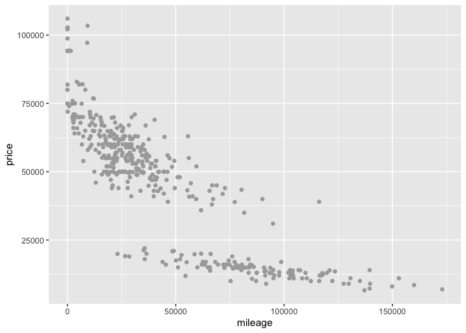
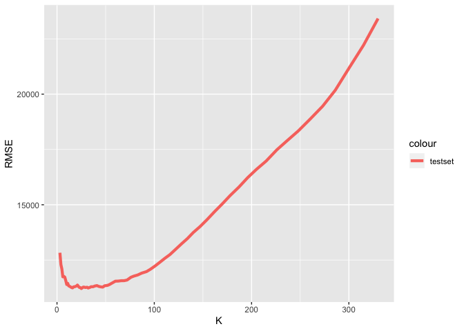
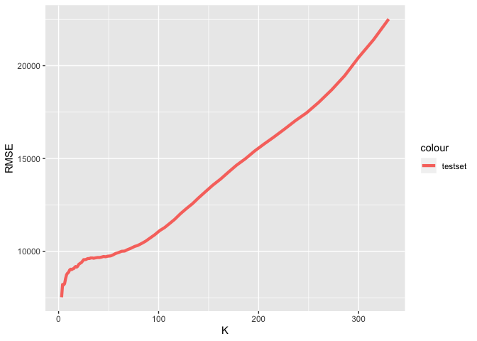
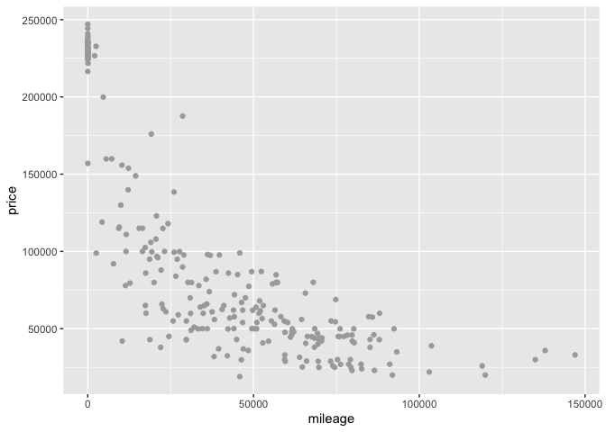
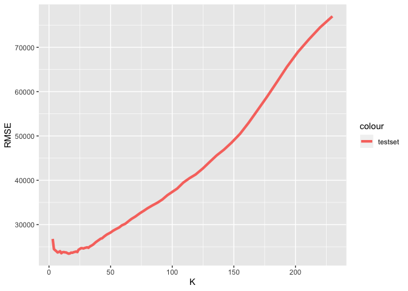
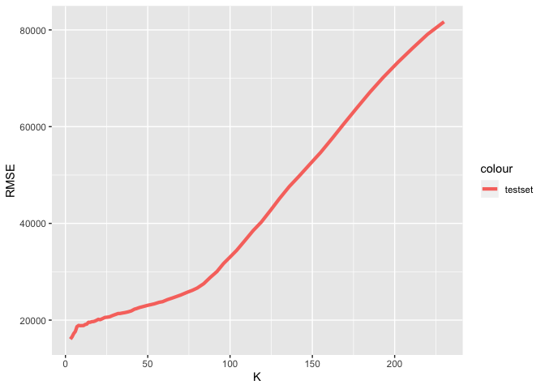
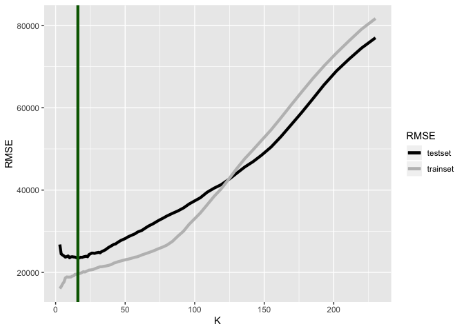
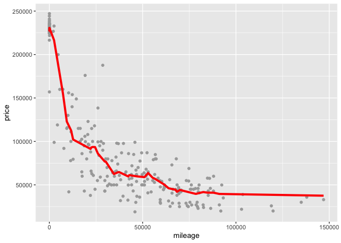

Exercise 1-2
============

Course: Data Mining and Statistical Learning (ECO395M) Name: Xuechun
Wang (xw5996) Date: Feburary 7th, 2020 Data Source: Sclass.csv

trim level 350
==============

trim level 350: out of sample RMSE versus K
===========================================

trim level 350: optimal K
=========================

    ## [1] 25

trim level 350: RMSE versus K
=============================

trim level 350: RMSE(2 types) versus K
======================================

trim level 350: K-nearest neighbors at the optimal K
====================================================

trim level 65AMG
================

trim level 65AMG: out of sample RMSE versus K
=============================================

trim level 65AMG: optimal K
===========================

    ## [1] 16

trim level 65AMG: RMSE versus K
===============================

trim level 65AMG: RMSE(2 types) versus K
========================================

trim level 65AMG: K-nearest neighbors at the optimal K
======================================================

Summary
=======

The optimal K are relatively small for both trim levels. I think the
main reason is that when you use a larger K to fit in the K-nearest
neighbor, the accuracy of y’s prediction will be reduced and will result
in a larger gap between actual y and predicted y, therefore the RMSE
will be larger.
