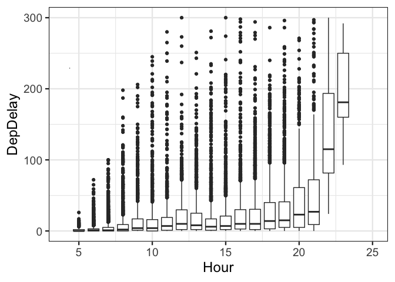
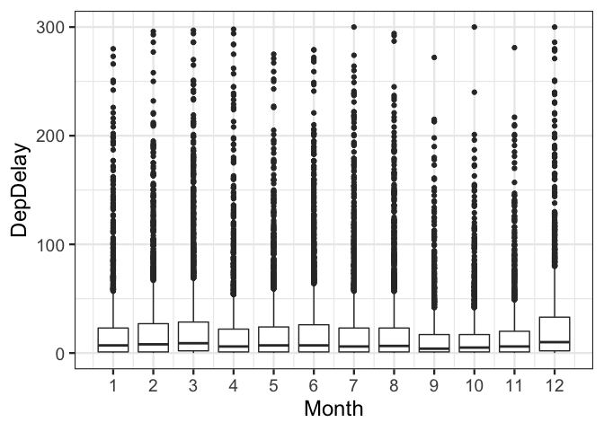
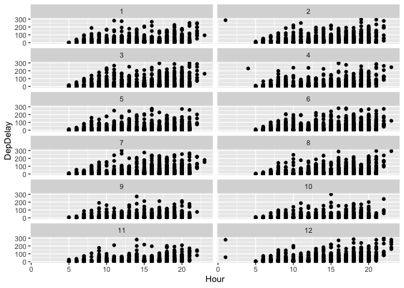
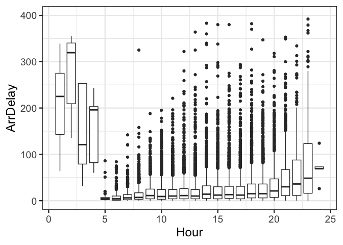
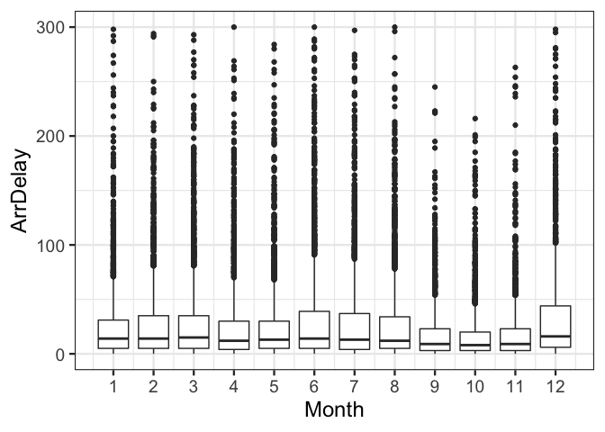
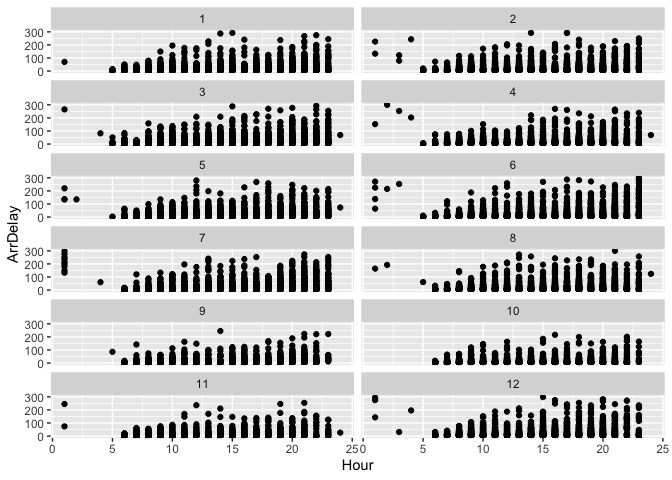

Exercise 1-1
============

-   Course: Data Mining and Statistical Learning (ECO395M)
-   Name: Xuechun Wang (xw5996)
-   Date: Feburary 7th, 2020
-   Data Source: ABIA.csv

What is the best time to fly from/arrive at Austin Airport?
===========================================================

I’m goin to show a set of plots here trying to help traveller and those
who always need to take a flight to figure out what is the best time to
fly from/arrive at Austin to minimum delays.

Best hour to fly from Austin in a day
=====================================

In general, the flights that departed from Austin at night had longer
delays, especially after 18:00. There is a significant trend of
increasing delays as it got later in a day. The delay during the
daytime(5:00-18:00) is not serious, and the overall delay is at a
relatively low level, but the flight at noon time(11:00-14:00) had
relatively longer delays than the flights in the morning(5:00-11:00) and
afternoon(14:00-18:00). Flights departed from Austin during the morning
had the shortest delay. So if you need to take a flight out of Austin, a
morning flight will be the best choice.

Best month to fly from Austin in a year
=======================================

The difference between months is not significant. The delays in
September were minimal. The overall delays in September, October, and
November were less, but the delays began to increased significantly in
December. Due to the arrival of the holiday season, people’s travel
increased, and the number of aircraft taking off at the airport in one
day increased, which made the delay time increase. In addition, the
overall delay in winter is relatively long, which is also related to the
extreme weather. For all other months, April had shorter delays in
average. In conclusion, if you want to choose a time to travel out of
Austin, Autumn(Sep-Nov) will be the best time.

Scatter plot (faceting on the third variable: Month)
====================================================

In different month group, the relationship between Departure hour and
Delay time didn’t have significant differences. For most of the month,
it would be better to take a morning flight or even a afternoon flight
than the flight departed at noon or at night.

Best hour to arrive at Austin in a day
======================================

In general, the flights that arrived at Austin at night had longer
arrival delays, especially after 20:00. There is a significant trend of
increasing delays as it got later in a day. The delay during the
daytime(5:00-19:00) is not serious, and the overall delay is at a
relatively low level. Flights arrived at Austin during the morning had
the shortest delay. So if you need to take a flight to Austin, a flight
arrived at morning will be the best choice.

Best month to arrive at Austin in a year
========================================

The difference between months is not significant. The delays in October
were minimal. The overall delays in September, October, and November
were less, but the delays began to increased significantly in December.
For all other months, April had shorter delays in average. And the
overall Arrival Delay had very similar trend with the Departure Delay,
which make me believe that there is a strong connection between the
Departure Delay and Arrival Delay. And the Delay trend didn’t just apply
to Austin Airport but all other airports in the U.S. In conclusion, if
you want to choose a time to travel to Austin, Autumn(Sep-Nov) will be
the best time to minimize your delay when taking flights.

Scatter plot (faceting on the third variable: Month)
====================================================

In different month group, the relationship between Arrival hour and
Delay time didn’t have significant differences. For most of the month,
it would be better to take a flight arrived at Austin in morning to
minimize delays.

Summary
=======

In Conclusion, the best time to fly from Austin has very similar trends
with the best time to arrive at Austin, which implies that there is a
strong connection between Departure Delays and Arrival Delays. And it
also implies that this trend applies to most of the U.S. airport
(because the arrival flights flied to Austin from other cities). For
those who traveled a lot by flights, the best time to fly from/arrive at
Austin will be morning. And for those who are planning a trip to Austin
or are trying to travel to somewhere else from Austin, Autumn will be
the best time of a year to minimize flight delays.
