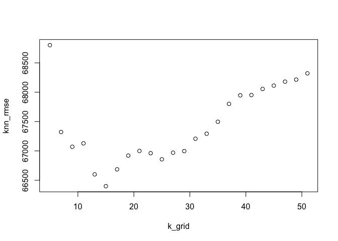

Question 1
================

Firstly, we summarize the statistics of the data SaratogaHouses.

``` 
     price           lotSize             age           landValue     
 Min.   :  5000   Min.   : 0.0000   Min.   :  0.00   Min.   :   200  
 1st Qu.:145000   1st Qu.: 0.1700   1st Qu.: 13.00   1st Qu.: 15100  
 Median :189900   Median : 0.3700   Median : 19.00   Median : 25000  
 Mean   :211967   Mean   : 0.5002   Mean   : 27.92   Mean   : 34557  
 3rd Qu.:259000   3rd Qu.: 0.5400   3rd Qu.: 34.00   3rd Qu.: 40200  
 Max.   :775000   Max.   :12.2000   Max.   :225.00   Max.   :412600  
   livingArea     pctCollege       bedrooms       fireplaces    
 Min.   : 616   Min.   :20.00   Min.   :1.000   Min.   :0.0000  
 1st Qu.:1300   1st Qu.:52.00   1st Qu.:3.000   1st Qu.:0.0000  
 Median :1634   Median :57.00   Median :3.000   Median :1.0000  
 Mean   :1755   Mean   :55.57   Mean   :3.155   Mean   :0.6019  
 3rd Qu.:2138   3rd Qu.:64.00   3rd Qu.:4.000   3rd Qu.:1.0000  
 Max.   :5228   Max.   :82.00   Max.   :7.000   Max.   :4.0000  
   bathrooms       rooms                   heating           fuel     
 Min.   :0.0   Min.   : 2.000   hot air        :1121   gas     :1197  
 1st Qu.:1.5   1st Qu.: 5.000   hot water/steam: 302   electric: 315  
 Median :2.0   Median : 7.000   electric       : 305   oil     : 216  
 Mean   :1.9   Mean   : 7.042                                         
 3rd Qu.:2.5   3rd Qu.: 8.250                                         
 Max.   :4.5   Max.   :12.000                                         
               sewer      waterfront newConstruction centralAir
 septic           : 503   Yes:  15   Yes:  81        Yes: 635  
 public/commercial:1213   No :1713   No :1647        No :1093  
 none             :  12                                        
                                                               
                                                               
                                                               
```

Then, we set up the medium model by hand, by adding the main 11
variables sequentially and the concerning interactions. We include the
first variable lotSize and see the coefficients.

    (Intercept)     lotSize 
      200807.69    22308.47 

We include the variable lotSize and age, and see the coefficients.

    (Intercept)     lotSize         age 
    218545.2033  21879.3477   -627.6974 

We include the variable lotSize, age and the interaction of lotSize and
age, and see the coefficients.

    (Intercept)     lotSize         age lotSize:age 
    215078.4883  28873.0550   -502.1170   -259.5175 

We include the variable lotSize, age, the interaction of lotSize and
age, and the living Area and see the coefficients.

    (Intercept)     lotSize         age  livingArea lotSize:age 
    17103.10048 15096.29776   -65.15763   110.34669  -331.94638 

We include the variable lotSize, age, the interaction of lotSize and
age,the living Area, the pctCollege, and see the coefficients.

``` 
 (Intercept)      lotSize          age   livingArea   pctCollege 
-10677.32879  15932.43297    -60.28486    108.29895    557.05779 
 lotSize:age 
  -341.81636 
```

We include the variable lotSize, age, the interaction of lotSize and
age,the living Area, the pctCollege, bedrooms, and see the coefficients.

``` 
 (Intercept)      lotSize          age   livingArea   pctCollege 
  6880.01835  15836.66594    -11.48982    119.72340    583.96868 
    bedrooms  lotSize:age 
-12844.47869   -334.37183 
```

We include the variable lotSize, age, the interaction of lotSize and
age,the living Area, the pctCollege, bedrooms, fireplaces, and see the
coefficients.

``` 
  (Intercept)       lotSize           age    livingArea    pctCollege 
  9346.914936  15749.610462     -2.464773    117.572383    538.532498 
     bedrooms    fireplaces   lotSize:age 
-12727.658870   5409.580177   -334.357763 
```

We include the variable lotSize, age, the interaction of lotSize and
age,the living Area, the pctCollege, bedrooms, fireplaces, bathrooms,
and see the
    coefficients.

    (Intercept)     lotSize         age  livingArea  pctCollege    bedrooms 
     -8809.2950  16596.8784    135.6488    101.4147    520.0045 -13539.9979 
     fireplaces   bathrooms lotSize:age 
      2587.7890  25042.5778   -338.8831 

We include the variable lotSize, age, the interaction of lotSize a,nd
age,the living Area, the pctCollege, bedrooms, fireplaces, bathrooms,
rooms and see the coefficients.

``` 
 (Intercept)      lotSize          age   livingArea   pctCollege 
-11198.13780  16449.47270    137.84125     94.72551    520.52469 
    bedrooms   fireplaces    bathrooms        rooms  lotSize:age 
-16755.99662   2928.93036  25133.97199   3393.12946   -340.02377 
```

We include the variable lotSize, age, the interaction of lotSize a,nd
age,the living Area, the pctCollege, bedrooms, fireplaces, bathrooms,
rooms, heating, and see the coefficients.

``` 
           (Intercept)                lotSize                    age 
           -1683.31117            16980.28008              160.52149 
            livingArea             pctCollege               bedrooms 
              93.37762              496.87160           -16472.74733 
            fireplaces              bathrooms                  rooms 
            2675.31068            24635.18651             3269.77734 
heatinghot water/steam        heatingelectric            lotSize:age 
          -15555.66440           -17084.00541             -334.45326 
```

We include the variable lotSize, age, the interaction of lotSize a,nd
age,the living Area, the pctCollege, bedrooms, fireplaces, bathrooms,
rooms, heating, fuel, and see the coefficients.

``` 
           (Intercept)                lotSize                    age 
            2066.77969            17628.94056              171.08399 
            livingArea             pctCollege               bedrooms 
              93.34881              459.53163           -16658.86051 
            fireplaces              bathrooms                  rooms 
            2642.80988            24426.32646             3244.33186 
heatinghot water/steam        heatingelectric           fuelelectric 
          -15363.11521            -7023.42822           -11672.84106 
               fueloil            lotSize:age 
           -7289.10548             -322.10136 
```

We include the variable lotSize, age, the interaction of lotSize a,nd
age,the living Area, the pctCollege, bedrooms, fireplaces, bathrooms,
rooms, heating, fuel, and the central Air, and see the coefficients.

``` 
           (Intercept)                lotSize                    age 
           21264.18626            17843.26863              201.80328 
            livingArea             pctCollege               bedrooms 
              91.69937              327.48731           -15379.37139 
            fireplaces              bathrooms                  rooms 
            1036.41911            22314.39244             3271.71301 
heatinghot water/steam        heatingelectric           fuelelectric 
           -9605.20645            -1738.08234           -13095.68977 
               fueloil           centralAirNo            lotSize:age 
           -6205.44804           -17290.15960             -326.35944 
```

In order to judge the effect of different variables and interations, we
set up the train sets and test sets to calculate the rmse of different
models, and to figure out how much a variable and interation will affect
the RMSE of the model.Then we can receive the root mean-squared
prediction error of the 12 hand-built models.

The following column show the rmse of the 12 models respectively.
Relatively, we want to receive the smaller RMSE as we can. From the RMSE
result below, we can see that by adding the interactions and the
variables, the RMSE starts to decrease. And most importantly, the
variable Living Area helps to decrease the RMSE a lot, which helps
decrease the RMSE from 92059.85 to 68178.11, which shows a significant
influence. Also, we can see that the final model, the model 12, which
includes the 11 main effects leads to the smallest RMSE as 64853.2.

    [1] 87395.4

    [1] 84981.65

    [1] 85011.96

    [1] 54710.61

    [1] 54579.81

    [1] 54341.08

    [1] 54294.14

    [1] 53500.93

    [1] 53401.44

    [1] 52872.39

    [1] 52932.92

    [1] 52618.69

Now, we start to consider the KNN model Firstly, we set up the model
matrix and scale it up, by considering the 11 main variables for the
effects of the price. And we can receive the result of knn model.

``` 
               lotSize                    age             livingArea 
                  0.11                 153.00                1383.00 
            pctCollege               bedrooms             fireplaces 
                 57.00                   3.00                   0.00 
             bathrooms                  rooms         heatinghot air 
                  2.00                   5.00                   0.00 
heatinghot water/steam        heatingelectric           fuelelectric 
                  1.00                   0.00                   0.00 
               fueloil           centralAirNo 
                  0.00                   1.00 
```

``` 
   price lotSize age landValue livingArea pctCollege bedrooms fireplaces
1 132500    0.09  42     50000        906         35        2          1
  bathrooms rooms  heating     fuel  sewer waterfront newConstruction
1         1     5 electric electric septic         No              No
  centralAir
1         No
```

    Warning: executing %dopar% sequentially: no parallel backend registered

Finally, by drawing the plot of the relationship of k\_grid and the
knn\_rmse, we can generally say that as k=15, the RMSE is the smallest,
so we can use it as our best model.
<!-- -->

In a conclusion, for the hand-built linear model, we can say that there
are 11 main variables will affect the price, which includes lotSize,
age, the number of bedrooms, and the most importantly, the square of
Living Area, according to the change of RMSE. So for considering the
prices of the houses, it is important to consider these 11 variables and
especially the square of living area.

We also set up a nonparametric model, the knn model, the result shows
that as k=5, the rmse is the smallest which is lower than 66500, and it
is close to the rmse value of model 12.
