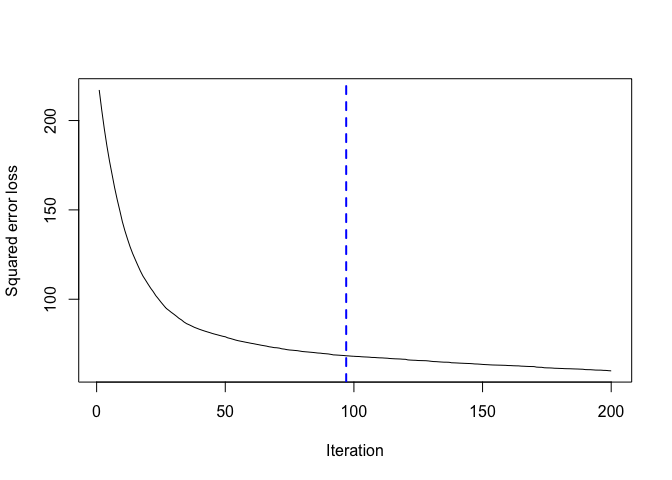

Exercise 3-1
============

-   Course: Data Mining and Statistical Learning (ECO395M)
-   Name: Xuechun Wang (xw5996)、Hanqi Liu(hl27963)
-   Date: April 19th, 2020
-   Data Source: greenbuildings.csv

Introduction
============

The greenbuildings.csv contains data on 7,894 commercial rental
properties from across the United States. Of these, 685 properties have
been awarded either LEED or EnergyStar certification as a green
building. Here, we’re trying to build the best predictive model possible
for price and to use this model to quantify the average change in rental
income per square foot (whether in absolute or percentage terms)
associated with green certification, holding other features of the
building constant.

The best model - boosted regression trees
=========================================

-   Why?

1.  Why regression trees? Trees handles categorical/numeric x and y
    nicely and don’t have to think about the scale of x’s. In this case,
    we have a lot of explanatory variables. In stead of considering the
    scale of x’s and make right transformation for using regression
    variable selection model, regression trees will be better a better
    choice.
2.  Why boosted regression trees? Regression trees’ step function is
    crude, does not give the best predictive performance. Boosting is a
    numerical optimization technique for minimizing the loss function by
    adding, at each step, a new tree that best reduces (steps down the
    gradient of) the loss function. Using boosted regression trees can
    help us get a better model. Also, we hope to quantify the average
    change in rental income per square foot associated with green
    certification. Using partial dependence functions after boosted
    regression trees can help us achieve this.

-   First, we start with n.trees=500, which is a relatively large number
    of iterations.

Notes: for the green certification, I use a single “green certified”
category rather than considering LEED and EnergyStar separately; also,
for the number of degree days, I use heating and cooling separately
rather than using a total number.

Looking at the error curve: stops decreasing much at somewhere between
100-200.

    ## [1] 96
    ## attr(,"smoother")
    ## Call:
    ## loess(formula = object$oobag.improve ~ x, enp.target = min(max(4, 
    ##     length(x)/10), 50))
    ## 
    ## Number of Observations: 500 
    ## Equivalent Number of Parameters: 39.85 
    ## Residual Standard Error: 0.09044

-   Then we refit with a more suitable number of iterations:
    n.trees=200.

<!-- -->

    ## gbm(formula = Rent ~ . - CS_PropertyID - LEED - Energystar - 
    ##     total_dd_07, data = green_train, n.trees = 200, interaction.depth = 4, 
    ##     shrinkage = 0.05)
    ## A gradient boosted model with gaussian loss function.
    ## 200 iterations were performed.
    ## There were 18 predictors of which 16 had non-zero influence.

    ## [1] 113
    ## attr(,"smoother")
    ## Call:
    ## loess(formula = object$oobag.improve ~ x, enp.target = min(max(4, 
    ##     length(x)/10), 50))
    ## 
    ## Number of Observations: 200 
    ## Equivalent Number of Parameters: 16.06 
    ## Residual Standard Error: 0.156

-   Calculate the RMSE

As we can see the result, the RMSE is relatively low, which means the
model works pretty good.

    ## [1] 8.692981

-   Relative importance measures: how much each variable reduces the MSE

As we can see in the result, cluster rent and size are the most
important factors.

    ##                                 var     rel.inf
    ## cluster_rent           cluster_rent 71.17073776
    ## size                           size 13.53533650
    ## leasing_rate           leasing_rate  5.74012801
    ## age                             age  3.05879064
    ## stories                     stories  2.02300521
    ## class_a                     class_a  1.28910586
    ## cluster                     cluster  1.00309732
    ## cd_total_07             cd_total_07  0.68523544
    ## class_b                     class_b  0.39029323
    ## Electricity_Costs Electricity_Costs  0.36576964
    ## Precipitation         Precipitation  0.35811266
    ## hd_total07               hd_total07  0.12837134
    ## amenities                 amenities  0.09574291
    ## renovated                 renovated  0.06396301
    ## Gas_Costs                 Gas_Costs  0.05028124
    ## green_rating           green_rating  0.04202923
    ## empl_gr                     empl_gr  0.00000000
    ## net                             net  0.00000000

Average change in Rent associated with green certification
==========================================================

-   Exploring the fit with partial dependence functions

    ##   green_rating     yhat
    ## 1            0 28.48336
    ## 2            1 28.66386

As we can see in the result, the green certification don’t have a huge
impact on rental income per square foot, having green certification
increases the rent by 0.25 per square foot.

Conclusion
==========

In this case, we choose boosted regression trees to build the best
rental price predicted model using data from greenbuildings.csv, and
with partial dependence functions we can find that having green
certification increases the rent by 0.25 per square foot.
