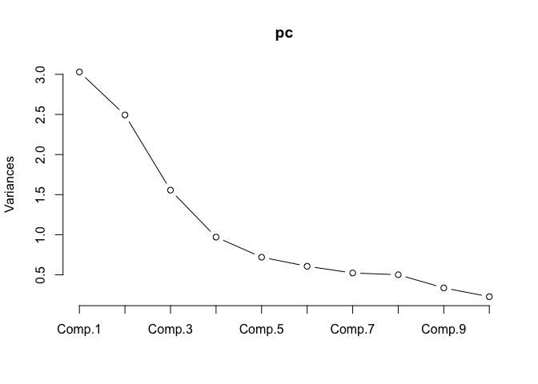
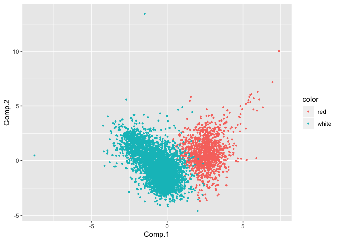
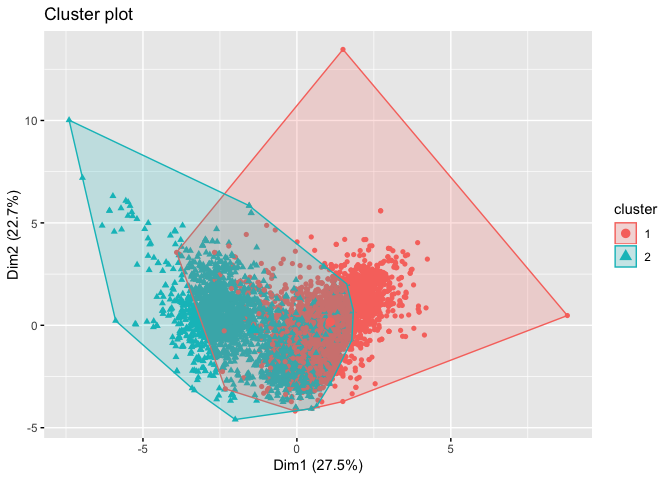
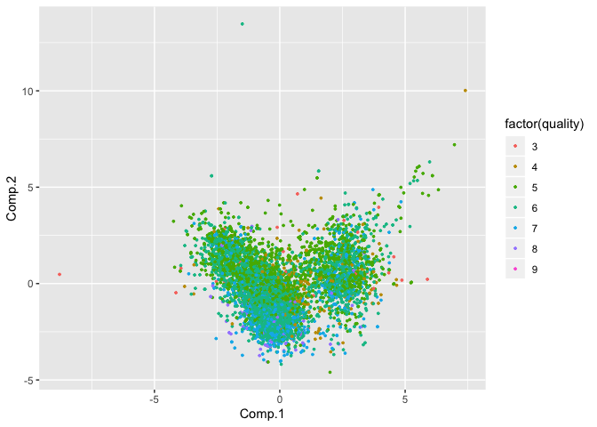
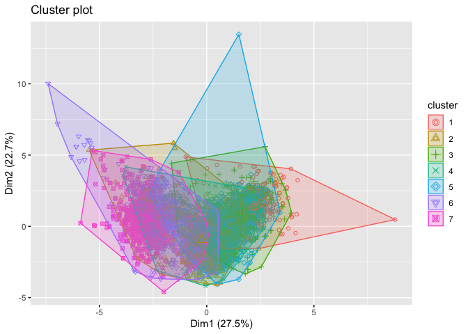

Exercise 3-3
============

-   Course: Data Mining and Statistical Learning (ECO395M)
-   Name: Xuechun Wang (xw5996)、Hanqi Liu(hl27963)
-   Date: April 20th, 2020
-   Data Source: wine.csv

Introduction
============

The data in wine.csv contains information on 11 chemical properties of
6500 different bottles of vinho verde wine from northern Portugal. In
addition, two other variables about each wine are recorded: color and
quality. We’ll run both PCA and a clustering algorithm here, trying to
find the best methos that is easily capable of distinguishing the reds
from the whites, using only the “unsupervised” information contained in
the data on chemical properties. Also, we’ll check whether this
technique capable of sorting the higher from the lower quality wines.

Distinguish the reds from whites - PCA
======================================

-   choose quantity of components (unsupervised chemical properties)

    ## Importance of components:
    ##                           Comp.1    Comp.2    Comp.3     Comp.4     Comp.5
    ## Standard deviation     1.7406518 1.5791852 1.2475364 0.98516602 0.84845443
    ## Proportion of Variance 0.2754426 0.2267115 0.1414861 0.08823201 0.06544317
    ## Cumulative Proportion  0.2754426 0.5021541 0.6436401 0.73187216 0.79731533
    ##                            Comp.6     Comp.7     Comp.8     Comp.9
    ## Standard deviation     0.77930207 0.72329715 0.70817391 0.58053772
    ## Proportion of Variance 0.05521016 0.04755989 0.04559184 0.03063855
    ## Cumulative Proportion  0.85252548 0.90008537 0.94567722 0.97631577
    ##                           Comp.10     Comp.11
    ## Standard deviation     0.47717477 0.181192721
    ## Proportion of Variance 0.02069961 0.002984618
    ## Cumulative Proportion  0.99701538 1.000000000

From the screeplot and the result, we find that the optimal number of
principal component is 4. The cumulative proportion of variance is 0.73,
which means 73% of the imformation contains in the four components.
Therefore, we should choose use 4 components.

I use both 4 components and 3 components to do the visualization.
However, the plot we made with either 3 components or 4 components are
not clear and useful for us to achieve the goals of distinguishing reds
from whites. Therfore, I turned to 2 components.

-   visulazation

Using the 1st component as x-axis and 2nd component as y-axis, with the
color of points representing the type of wine (red and white). We can
easily distinguish the reds from the whites using this method.

Distinguish the reds from whites - Clustering (kmeans)
======================================================

From the result, we can find the observations are divided into 2
clusters. The size of the two clusters is 2808 and 3689 respectively
(the results is not showed in this report, see in the Rmd file).

Then we visualize the result of the clustering method:

Distinguish the reds from whites - Conclusion
=============================================

Comparing the two plots, for the variable ‘color’ of the wine, in
k-means clustering plot, there is an overlap between two clusters,
however, the two groups in PCA plot are more separated from each other,
which means PCA method performs better.

Extension: Distinguish the reds from whites
===========================================

-   PCA

-   Clustering: kmeans

Since the value of quality in the data set is from 3 to 9, we set the
number of clusters as 7

-   Conclusion

From the plots, it can be found that both the PCA and k-means clustering
plots are not well separated. Both method is not appropriate for
distinguishing the quality of the wine.
