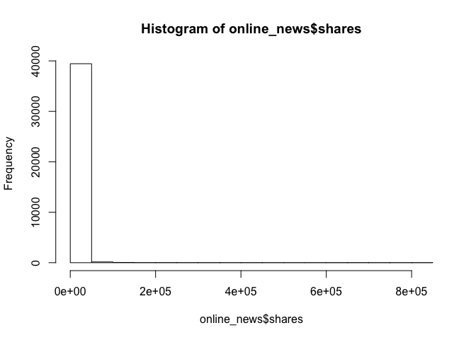
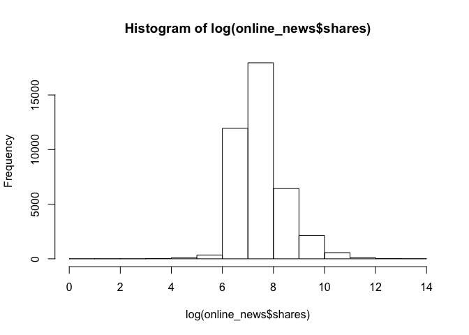

Exercise 2-3
============

-   Course: Data Mining and Statistical Learning (ECO395M)
-   Name: Xuechun Wang (xw5996)、Hanqi Liu(hl27963)
-   Date: March 6th, 2020
-   Data Source: online\_news.csv

Preparation for model building
==============================

Before building model, we need to choose the right form of “shares”.
Here is a histogram of “shares”:

From the histogram, we can see that “shares” is hugely skewed, so we
probably want a log transformation for “shares”. Here is a histogram of
“log(shares)”:

First approach: build the best model
====================================

-   First, build a baseline model with log(shares) versus all variables
    except url

<!-- -->

    Call:
    lm(formula = log(shares) ~ . - url - viral, data = online_news)

    Residuals:
        Min      1Q  Median      3Q     Max 
    -7.6606 -0.5657 -0.1781  0.4112  6.0146 

    Coefficients: (2 not defined because of singularities)
                                    Estimate Std. Error t value Pr(>|t|)    
    (Intercept)                    7.897e+00  4.360e-02 181.133  < 2e-16 ***
    n_tokens_title                 3.314e-03  2.167e-03   1.529  0.12628    
    n_tokens_content               1.352e-05  1.394e-05   0.970  0.33209    
    num_hrefs                      6.175e-03  4.990e-04  12.374  < 2e-16 ***
    num_self_hrefs                -1.074e-02  1.363e-03  -7.880 3.36e-15 ***
    num_imgs                       4.508e-03  6.343e-04   7.108 1.20e-12 ***
    num_videos                     3.243e-03  1.176e-03   2.757  0.00583 ** 
    average_token_length          -6.305e-02  7.276e-03  -8.667  < 2e-16 ***
    num_keywords                   1.658e-02  2.464e-03   6.730 1.72e-11 ***
    data_channel_is_lifestyle     -1.874e-01  2.345e-02  -7.993 1.35e-15 ***
    data_channel_is_entertainment -4.419e-01  1.642e-02 -26.916  < 2e-16 ***
    data_channel_is_bus           -2.683e-01  1.808e-02 -14.840  < 2e-16 ***
    data_channel_is_socmed         5.294e-02  2.299e-02   2.303  0.02129 *  
    data_channel_is_tech          -1.220e-01  1.723e-02  -7.081 1.45e-12 ***
    data_channel_is_world         -4.990e-01  1.742e-02 -28.647  < 2e-16 ***
    self_reference_min_shares      7.542e-07  5.814e-07   1.297  0.19455    
    self_reference_max_shares      2.516e-07  3.151e-07   0.798  0.42459    
    self_reference_avg_sharess     1.812e-06  8.065e-07   2.247  0.02462 *  
    weekday_is_monday             -2.349e-01  2.030e-02 -11.572  < 2e-16 ***
    weekday_is_tuesday            -2.930e-01  2.000e-02 -14.651  < 2e-16 ***
    weekday_is_wednesday          -2.948e-01  1.999e-02 -14.742  < 2e-16 ***
    weekday_is_thursday           -2.847e-01  2.004e-02 -14.205  < 2e-16 ***
    weekday_is_friday             -2.214e-01  2.076e-02 -10.664  < 2e-16 ***
    weekday_is_saturday            1.004e-02  2.477e-02   0.405  0.68522    
    weekday_is_sunday                     NA         NA      NA       NA    
    is_weekend                            NA         NA      NA       NA    
    global_rate_positive_words     2.474e-01  3.218e-01   0.769  0.44192    
    global_rate_negative_words    -6.403e-01  5.076e-01  -1.262  0.20713    
    avg_positive_polarity          2.259e-01  8.173e-02   2.764  0.00572 ** 
    min_positive_polarity         -2.753e-01  8.532e-02  -3.226  0.00125 ** 
    max_positive_polarity         -2.889e-02  3.262e-02  -0.885  0.37592    
    avg_negative_polarity         -3.613e-01  9.022e-02  -4.005 6.21e-05 ***
    min_negative_polarity          2.407e-02  3.507e-02   0.686  0.49259    
    max_negative_polarity          1.364e-01  7.889e-02   1.729  0.08387 .  
    title_subjectivity             3.950e-02  2.001e-02   1.974  0.04835 *  
    title_sentiment_polarity       6.976e-02  1.915e-02   3.643  0.00027 ***
    abs_title_sentiment_polarity   3.276e-02  3.052e-02   1.073  0.28321    
    ---
    Signif. codes:  0 '***' 0.001 '**' 0.01 '*' 0.05 '.' 0.1 ' ' 1

    Residual standard error: 0.8895 on 39609 degrees of freedom
    Multiple R-squared:  0.08689,   Adjusted R-squared:  0.0861 
    F-statistic: 110.9 on 34 and 39609 DF,  p-value: < 2.2e-16

-   Second, drop things that seem (nearly) perfectly collinear with
    other variables

<!-- -->

    Call:
    lm(formula = log(shares) ~ . - url - n_tokens_content - self_reference_max_shares - 
        weekday_is_saturday - weekday_is_sunday - is_weekend - max_positive_polarity - 
        min_negative_polarity - viral, data = online_news)

    Residuals:
        Min      1Q  Median      3Q     Max 
    -7.6635 -0.5651 -0.1783  0.4124  6.0075 

    Coefficients:
                                    Estimate Std. Error t value Pr(>|t|)    
    (Intercept)                    7.902e+00  4.173e-02 189.353  < 2e-16 ***
    n_tokens_title                 3.260e-03  2.165e-03   1.506 0.132117    
    num_hrefs                      6.234e-03  4.840e-04  12.880  < 2e-16 ***
    num_self_hrefs                -1.043e-02  1.330e-03  -7.840 4.60e-15 ***
    num_imgs                       4.614e-03  6.063e-04   7.611 2.78e-14 ***
    num_videos                     3.372e-03  1.167e-03   2.890 0.003853 ** 
    average_token_length          -6.365e-02  7.249e-03  -8.781  < 2e-16 ***
    num_keywords                   1.654e-02  2.463e-03   6.714 1.91e-11 ***
    data_channel_is_lifestyle     -1.856e-01  2.317e-02  -8.014 1.14e-15 ***
    data_channel_is_entertainment -4.403e-01  1.613e-02 -27.305  < 2e-16 ***
    data_channel_is_bus           -2.660e-01  1.762e-02 -15.092  < 2e-16 ***
    data_channel_is_socmed         5.540e-02  2.273e-02   2.438 0.014784 *  
    data_channel_is_tech          -1.199e-01  1.677e-02  -7.147 9.00e-13 ***
    data_channel_is_world         -4.969e-01  1.677e-02 -29.626  < 2e-16 ***
    self_reference_min_shares      4.178e-07  3.966e-07   1.054 0.292086    
    self_reference_avg_sharess     2.399e-06  3.237e-07   7.411 1.28e-13 ***
    weekday_is_monday             -2.401e-01  1.657e-02 -14.490  < 2e-16 ***
    weekday_is_tuesday            -2.980e-01  1.620e-02 -18.398  < 2e-16 ***
    weekday_is_wednesday          -2.998e-01  1.620e-02 -18.508  < 2e-16 ***
    weekday_is_thursday           -2.897e-01  1.626e-02 -17.818  < 2e-16 ***
    weekday_is_friday             -2.263e-01  1.714e-02 -13.205  < 2e-16 ***
    global_rate_positive_words     1.911e-01  3.110e-01   0.614 0.538945    
    global_rate_negative_words    -7.000e-01  4.954e-01  -1.413 0.157645    
    avg_positive_polarity          1.822e-01  6.173e-02   2.951 0.003167 ** 
    min_positive_polarity         -2.586e-01  7.897e-02  -3.275 0.001057 ** 
    avg_negative_polarity         -3.143e-01  5.282e-02  -5.951 2.68e-09 ***
    max_negative_polarity          1.145e-01  6.535e-02   1.752 0.079814 .  
    title_subjectivity             3.970e-02  2.000e-02   1.985 0.047184 *  
    title_sentiment_polarity       6.962e-02  1.913e-02   3.640 0.000273 ***
    abs_title_sentiment_polarity   3.286e-02  3.051e-02   1.077 0.281364    
    ---
    Signif. codes:  0 '***' 0.001 '**' 0.01 '*' 0.05 '.' 0.1 ' ' 1

    Residual standard error: 0.8895 on 39614 degrees of freedom
    Multiple R-squared:  0.08683,   Adjusted R-squared:  0.08616 
    F-statistic: 129.9 on 29 and 39614 DF,  p-value: < 2.2e-16

-   Third, use stepwise selection to build a “best” model In order to
    save the running time of the program，we choose steps = 2 here, to
    improve just a little bit from the baseline model

<!-- -->

    lm(formula = log(shares) ~ n_tokens_title + num_hrefs + num_self_hrefs + 
        num_imgs + num_videos + average_token_length + num_keywords + 
        data_channel_is_lifestyle + data_channel_is_entertainment + 
        data_channel_is_bus + data_channel_is_socmed + data_channel_is_tech + 
        data_channel_is_world + self_reference_min_shares + self_reference_avg_sharess + 
        weekday_is_monday + weekday_is_tuesday + weekday_is_wednesday + 
        weekday_is_thursday + weekday_is_friday + global_rate_positive_words + 
        global_rate_negative_words + avg_positive_polarity + min_positive_polarity + 
        avg_negative_polarity + max_negative_polarity + title_subjectivity + 
        title_sentiment_polarity + abs_title_sentiment_polarity + 
        self_reference_min_shares:self_reference_avg_sharess + num_self_hrefs:num_imgs, 
        data = online_news)

    Call:
    lm(formula = log(shares) ~ n_tokens_title + num_hrefs + num_self_hrefs + 
        num_imgs + num_videos + average_token_length + num_keywords + 
        data_channel_is_lifestyle + data_channel_is_entertainment + 
        data_channel_is_bus + data_channel_is_socmed + data_channel_is_tech + 
        data_channel_is_world + self_reference_min_shares + self_reference_avg_sharess + 
        weekday_is_monday + weekday_is_tuesday + weekday_is_wednesday + 
        weekday_is_thursday + weekday_is_friday + global_rate_positive_words + 
        global_rate_negative_words + avg_positive_polarity + min_positive_polarity + 
        avg_negative_polarity + max_negative_polarity + title_subjectivity + 
        title_sentiment_polarity + abs_title_sentiment_polarity + 
        self_reference_min_shares:self_reference_avg_sharess + num_self_hrefs:num_imgs, 
        data = online_news)

    Residuals:
        Min      1Q  Median      3Q     Max 
    -7.6725 -0.5606 -0.1768  0.4092  5.9380 

    Coefficients:
                                                           Estimate Std. Error
    (Intercept)                                           7.873e+00  4.150e-02
    n_tokens_title                                        3.508e-03  2.151e-03
    num_hrefs                                             6.583e-03  4.813e-04
    num_self_hrefs                                        7.302e-04  1.636e-03
    num_imgs                                              9.320e-03  7.669e-04
    num_videos                                            3.281e-03  1.159e-03
    average_token_length                                 -7.335e-02  7.218e-03
    num_keywords                                          1.504e-02  2.451e-03
    data_channel_is_lifestyle                            -1.654e-01  2.304e-02
    data_channel_is_entertainment                        -4.105e-01  1.608e-02
    data_channel_is_bus                                  -2.294e-01  1.758e-02
    data_channel_is_socmed                                6.817e-02  2.259e-02
    data_channel_is_tech                                 -9.313e-02  1.670e-02
    data_channel_is_world                                -4.560e-01  1.676e-02
    self_reference_min_shares                             9.759e-06  6.053e-07
    self_reference_avg_sharess                            2.327e-06  3.218e-07
    weekday_is_monday                                    -2.418e-01  1.647e-02
    weekday_is_tuesday                                   -2.993e-01  1.610e-02
    weekday_is_wednesday                                 -3.016e-01  1.610e-02
    weekday_is_thursday                                  -2.896e-01  1.615e-02
    weekday_is_friday                                    -2.283e-01  1.703e-02
    global_rate_positive_words                            4.035e-01  3.093e-01
    global_rate_negative_words                           -5.720e-01  4.925e-01
    avg_positive_polarity                                 1.325e-01  6.138e-02
    min_positive_polarity                                -2.474e-01  7.851e-02
    avg_negative_polarity                                -2.755e-01  5.252e-02
    max_negative_polarity                                 9.923e-02  6.493e-02
    title_subjectivity                                    4.193e-02  1.988e-02
    title_sentiment_polarity                              7.090e-02  1.900e-02
    abs_title_sentiment_polarity                          2.621e-02  3.031e-02
    self_reference_min_shares:self_reference_avg_sharess -1.749e-11  8.701e-13
    num_self_hrefs:num_imgs                              -9.212e-04  8.907e-05
                                                         t value Pr(>|t|)    
    (Intercept)                                          189.713  < 2e-16 ***
    n_tokens_title                                         1.631 0.102880    
    num_hrefs                                             13.677  < 2e-16 ***
    num_self_hrefs                                         0.446 0.655375    
    num_imgs                                              12.152  < 2e-16 ***
    num_videos                                             2.829 0.004665 ** 
    average_token_length                                 -10.161  < 2e-16 ***
    num_keywords                                           6.137 8.50e-10 ***
    data_channel_is_lifestyle                             -7.179 7.14e-13 ***
    data_channel_is_entertainment                        -25.526  < 2e-16 ***
    data_channel_is_bus                                  -13.049  < 2e-16 ***
    data_channel_is_socmed                                 3.018 0.002550 ** 
    data_channel_is_tech                                  -5.575 2.49e-08 ***
    data_channel_is_world                                -27.202  < 2e-16 ***
    self_reference_min_shares                             16.121  < 2e-16 ***
    self_reference_avg_sharess                             7.231 4.89e-13 ***
    weekday_is_monday                                    -14.686  < 2e-16 ***
    weekday_is_tuesday                                   -18.590  < 2e-16 ***
    weekday_is_wednesday                                 -18.733  < 2e-16 ***
    weekday_is_thursday                                  -17.930  < 2e-16 ***
    weekday_is_friday                                    -13.406  < 2e-16 ***
    global_rate_positive_words                             1.304 0.192141    
    global_rate_negative_words                            -1.161 0.245451    
    avg_positive_polarity                                  2.158 0.030904 *  
    min_positive_polarity                                 -3.151 0.001629 ** 
    avg_negative_polarity                                 -5.247 1.56e-07 ***
    max_negative_polarity                                  1.528 0.126452    
    title_subjectivity                                     2.110 0.034895 *  
    title_sentiment_polarity                               3.731 0.000191 ***
    abs_title_sentiment_polarity                           0.865 0.387240    
    self_reference_min_shares:self_reference_avg_sharess -20.103  < 2e-16 ***
    num_self_hrefs:num_imgs                              -10.342  < 2e-16 ***
    ---
    Signif. codes:  0 '***' 0.001 '**' 0.01 '*' 0.05 '.' 0.1 ' ' 1

    Residual standard error: 0.8837 on 39612 degrees of freedom
    Multiple R-squared:  0.09867,   Adjusted R-squared:  0.09796 
    F-statistic: 139.9 on 31 and 39612 DF,  p-value: < 2.2e-16

First approach: asses the “best” model
======================================

In order to asses the “best” model, we will report the confusion matrix,
overall error rate, true positive rate, and false positive rate for the
best model here. To get more accurate result, we will average these
quantities across multiple train/test splits. And we will use three
different method to get the average results in this model and choose 1
method to apply to all other methods.

-   method 1 collect all predictions and corresponding “viral” value
    from all test set and put them in one confusion matrix, calculate
    overall error rate, true positive rate, and false positive rate base
    on this confusion matrix. Here is the confusion matrix:

<!-- -->

           0      1
    0 135258 266420
    1  57232 333990

overall error rate:

    [1] 0.4081877

true positive rate:

    [1] 0.8537097

false positive rate:

    [1] 0.6632676

-   method 2 Calculate the overall error rate, true positive rate, and
    false positive rate for each of the confusion matrix (for different
    test set), and average these quantities

overall error rate:

    [1] 0.4075508

true positive rate:

    [1] 0.8550395

false positive rate:

    [1] 0.6629083

-   method 3 For each of the confusion matrix (for different test set),
    we have four elements and denote them as \[1,1\], \[1,2\], \[2,1\],
    \[2,2\]. We average these four elements respectively across mulitple
    test sets and build a average confusion matrix, calculate overall
    error rate, true positive rate, and false positive rate base on this
    confusion matrix.

average confusion matrix:

            0      1
    0 1352.58 2664.2
    1  572.32 3339.9

overall error rate:

    [1] 0.4081877

true positive rate:

    [1] 0.8537097

false positive rate:

    [1] 0.6632676

First approach: build the baseline model
========================================

We build the baseline model with log(shares) versus all variables except
url

    Call:
    lm(formula = log(shares) ~ . - url - viral, data = online_news)

    Residuals:
        Min      1Q  Median      3Q     Max 
    -7.6606 -0.5657 -0.1781  0.4112  6.0146 

    Coefficients: (2 not defined because of singularities)
                                    Estimate Std. Error t value Pr(>|t|)    
    (Intercept)                    7.897e+00  4.360e-02 181.133  < 2e-16 ***
    n_tokens_title                 3.314e-03  2.167e-03   1.529  0.12628    
    n_tokens_content               1.352e-05  1.394e-05   0.970  0.33209    
    num_hrefs                      6.175e-03  4.990e-04  12.374  < 2e-16 ***
    num_self_hrefs                -1.074e-02  1.363e-03  -7.880 3.36e-15 ***
    num_imgs                       4.508e-03  6.343e-04   7.108 1.20e-12 ***
    num_videos                     3.243e-03  1.176e-03   2.757  0.00583 ** 
    average_token_length          -6.305e-02  7.276e-03  -8.667  < 2e-16 ***
    num_keywords                   1.658e-02  2.464e-03   6.730 1.72e-11 ***
    data_channel_is_lifestyle     -1.874e-01  2.345e-02  -7.993 1.35e-15 ***
    data_channel_is_entertainment -4.419e-01  1.642e-02 -26.916  < 2e-16 ***
    data_channel_is_bus           -2.683e-01  1.808e-02 -14.840  < 2e-16 ***
    data_channel_is_socmed         5.294e-02  2.299e-02   2.303  0.02129 *  
    data_channel_is_tech          -1.220e-01  1.723e-02  -7.081 1.45e-12 ***
    data_channel_is_world         -4.990e-01  1.742e-02 -28.647  < 2e-16 ***
    self_reference_min_shares      7.542e-07  5.814e-07   1.297  0.19455    
    self_reference_max_shares      2.516e-07  3.151e-07   0.798  0.42459    
    self_reference_avg_sharess     1.812e-06  8.065e-07   2.247  0.02462 *  
    weekday_is_monday             -2.349e-01  2.030e-02 -11.572  < 2e-16 ***
    weekday_is_tuesday            -2.930e-01  2.000e-02 -14.651  < 2e-16 ***
    weekday_is_wednesday          -2.948e-01  1.999e-02 -14.742  < 2e-16 ***
    weekday_is_thursday           -2.847e-01  2.004e-02 -14.205  < 2e-16 ***
    weekday_is_friday             -2.214e-01  2.076e-02 -10.664  < 2e-16 ***
    weekday_is_saturday            1.004e-02  2.477e-02   0.405  0.68522    
    weekday_is_sunday                     NA         NA      NA       NA    
    is_weekend                            NA         NA      NA       NA    
    global_rate_positive_words     2.474e-01  3.218e-01   0.769  0.44192    
    global_rate_negative_words    -6.403e-01  5.076e-01  -1.262  0.20713    
    avg_positive_polarity          2.259e-01  8.173e-02   2.764  0.00572 ** 
    min_positive_polarity         -2.753e-01  8.532e-02  -3.226  0.00125 ** 
    max_positive_polarity         -2.889e-02  3.262e-02  -0.885  0.37592    
    avg_negative_polarity         -3.613e-01  9.022e-02  -4.005 6.21e-05 ***
    min_negative_polarity          2.407e-02  3.507e-02   0.686  0.49259    
    max_negative_polarity          1.364e-01  7.889e-02   1.729  0.08387 .  
    title_subjectivity             3.950e-02  2.001e-02   1.974  0.04835 *  
    title_sentiment_polarity       6.976e-02  1.915e-02   3.643  0.00027 ***
    abs_title_sentiment_polarity   3.276e-02  3.052e-02   1.073  0.28321    
    ---
    Signif. codes:  0 '***' 0.001 '**' 0.01 '*' 0.05 '.' 0.1 ' ' 1

    Residual standard error: 0.8895 on 39609 degrees of freedom
    Multiple R-squared:  0.08689,   Adjusted R-squared:  0.0861 
    F-statistic: 110.9 on 34 and 39609 DF,  p-value: < 2.2e-16

First approach: asses the baseline model
========================================

In order to asses the baseline model, we will report the confusion
matrix, overall error rate, true positive rate, and false positive rate
for the best model here. To get more accurate result, we will average
these quantities across multiple train/test splits. And we will use the
method 1 metioned above, which is collecting all predictions and
corresponding “viral” value from all test set and put them in one
confusion matrix, calculating overall error rate, true positive rate,
and false positive rate base on this confusion matrix. Here is the
oncusion matrix:

           0      1
    0 130740 270907
    1  56432 334821

overall error rate:

    [1] 0.4128377

true positive rate:

    [1] 0.855766

false positive rate:

    [1] 0.6744903

First approach: summary
=======================

According to the overall error rate, true positive rate and false
positive rate we report (we only compares the result for method 1), the
best model we build have lower overall error rate and false positive
rate. As we only choose steps = 2 when using stepwise selection, so the
true positive rate seems not improve a lot, and it’s about the same for
two models. But in general, the best model we build performs better. As
we only choose steps = 2, I believe using stepwise selection and choose
higher/appropriate steps will help us build a better model.

Second approach: build the best model
=====================================

-   First, try on a model with viral versus all variables except url and
    shares

<!-- -->

    Call:
    lm(formula = viral ~ . - url - shares, data = online_train)

    Residuals:
        Min      1Q  Median      3Q     Max 
    -1.5135 -0.4393 -0.2466  0.4550  0.8073 

    Coefficients: (2 not defined because of singularities)
                                    Estimate Std. Error t value Pr(>|t|)    
    (Intercept)                    6.986e-01  2.615e-02  26.714  < 2e-16 ***
    n_tokens_title                -2.012e-03  1.300e-03  -1.547 0.121801    
    n_tokens_content               3.125e-05  8.361e-06   3.737 0.000186 ***
    num_hrefs                      2.654e-03  2.995e-04   8.860  < 2e-16 ***
    num_self_hrefs                -5.859e-03  8.141e-04  -7.197 6.27e-13 ***
    num_imgs                       1.309e-03  3.804e-04   3.441 0.000581 ***
    num_videos                     9.488e-04  7.110e-04   1.335 0.182043    
    average_token_length          -2.298e-02  4.372e-03  -5.256 1.48e-07 ***
    num_keywords                   9.530e-03  1.480e-03   6.438 1.23e-10 ***
    data_channel_is_lifestyle     -4.191e-02  1.415e-02  -2.962 0.003058 ** 
    data_channel_is_entertainment -2.114e-01  9.857e-03 -21.451  < 2e-16 ***
    data_channel_is_bus           -7.521e-02  1.084e-02  -6.936 4.10e-12 ***
    data_channel_is_socmed         1.318e-01  1.386e-02   9.505  < 2e-16 ***
    data_channel_is_tech           2.214e-02  1.033e-02   2.144 0.032061 *  
    data_channel_is_world         -2.196e-01  1.045e-02 -21.006  < 2e-16 ***
    self_reference_min_shares      1.878e-07  3.487e-07   0.539 0.590224    
    self_reference_max_shares      1.528e-07  1.861e-07   0.821 0.411779    
    self_reference_avg_sharess     6.146e-07  4.797e-07   1.281 0.200128    
    weekday_is_monday             -1.514e-01  1.217e-02 -12.441  < 2e-16 ***
    weekday_is_tuesday            -1.775e-01  1.199e-02 -14.809  < 2e-16 ***
    weekday_is_wednesday          -1.824e-01  1.199e-02 -15.213  < 2e-16 ***
    weekday_is_thursday           -1.634e-01  1.202e-02 -13.601  < 2e-16 ***
    weekday_is_friday             -1.198e-01  1.243e-02  -9.637  < 2e-16 ***
    weekday_is_saturday            5.293e-02  1.488e-02   3.558 0.000375 ***
    weekday_is_sunday                     NA         NA      NA       NA    
    is_weekend                            NA         NA      NA       NA    
    global_rate_positive_words     2.284e-01  1.940e-01   1.178 0.238944    
    global_rate_negative_words    -4.110e-01  3.023e-01  -1.360 0.173981    
    avg_positive_polarity          2.947e-02  4.899e-02   0.602 0.547466    
    min_positive_polarity         -1.081e-01  5.129e-02  -2.107 0.035104 *  
    max_positive_polarity          1.235e-02  1.956e-02   0.632 0.527592    
    avg_negative_polarity         -1.151e-01  5.418e-02  -2.124 0.033643 *  
    min_negative_polarity          2.480e-02  2.102e-02   1.180 0.238112    
    max_negative_polarity          3.870e-02  4.768e-02   0.812 0.416967    
    title_subjectivity             3.028e-02  1.205e-02   2.512 0.012017 *  
    title_sentiment_polarity       3.873e-02  1.150e-02   3.368 0.000758 ***
    abs_title_sentiment_polarity  -4.325e-03  1.840e-02  -0.235 0.814192    
    ---
    Signif. codes:  0 '***' 0.001 '**' 0.01 '*' 0.05 '.' 0.1 ' ' 1

    Residual standard error: 0.4775 on 31680 degrees of freedom
    Multiple R-squared:  0.08891,   Adjusted R-squared:  0.08793 
    F-statistic: 90.92 on 34 and 31680 DF,  p-value: < 2.2e-16

-   Second, drop things that seem (nearly) perfectly collinear with
    other variables

<!-- -->

    Call:
    lm(formula = viral ~ . - url - self_reference_min_shares - self_reference_max_shares - 
        weekday_is_sunday - is_weekend - avg_positive_polarity - 
        max_positive_polarity - min_negative_polarity - max_negative_polarity - 
        abs_title_sentiment_polarity - shares, data = online_train)

    Residuals:
        Min      1Q  Median      3Q     Max 
    -1.5201 -0.4397 -0.2482  0.4550  0.8021 

    Coefficients:
                                    Estimate Std. Error t value Pr(>|t|)    
    (Intercept)                    6.995e-01  2.612e-02  26.778  < 2e-16 ***
    n_tokens_title                -2.017e-03  1.299e-03  -1.552 0.120582    
    n_tokens_content               3.096e-05  7.238e-06   4.277 1.90e-05 ***
    num_hrefs                      2.687e-03  2.977e-04   9.026  < 2e-16 ***
    num_self_hrefs                -5.735e-03  7.956e-04  -7.208 5.80e-13 ***
    num_imgs                       1.335e-03  3.795e-04   3.516 0.000438 ***
    num_videos                     1.088e-03  7.065e-04   1.540 0.123639    
    average_token_length          -2.081e-02  4.050e-03  -5.138 2.79e-07 ***
    num_keywords                   9.584e-03  1.479e-03   6.478 9.46e-11 ***
    data_channel_is_lifestyle     -4.184e-02  1.415e-02  -2.958 0.003101 ** 
    data_channel_is_entertainment -2.111e-01  9.847e-03 -21.437  < 2e-16 ***
    data_channel_is_bus           -7.589e-02  1.082e-02  -7.012 2.39e-12 ***
    data_channel_is_socmed         1.308e-01  1.385e-02   9.449  < 2e-16 ***
    data_channel_is_tech           2.154e-02  1.031e-02   2.089 0.036674 *  
    data_channel_is_world         -2.217e-01  1.035e-02 -21.411  < 2e-16 ***
    self_reference_avg_sharess     9.621e-07  1.117e-07   8.610  < 2e-16 ***
    weekday_is_monday             -1.513e-01  1.217e-02 -12.437  < 2e-16 ***
    weekday_is_tuesday            -1.777e-01  1.199e-02 -14.823  < 2e-16 ***
    weekday_is_wednesday          -1.826e-01  1.199e-02 -15.227  < 2e-16 ***
    weekday_is_thursday           -1.636e-01  1.201e-02 -13.617  < 2e-16 ***
    weekday_is_friday             -1.198e-01  1.243e-02  -9.640  < 2e-16 ***
    weekday_is_saturday            5.302e-02  1.487e-02   3.564 0.000365 ***
    global_rate_positive_words     3.241e-01  1.815e-01   1.786 0.074189 .  
    global_rate_negative_words    -4.553e-01  2.764e-01  -1.647 0.099520 .  
    min_positive_polarity         -8.628e-02  4.238e-02  -2.036 0.041752 *  
    avg_negative_polarity         -6.168e-02  2.417e-02  -2.552 0.010717 *  
    title_subjectivity             2.876e-02  8.739e-03   3.291 0.000998 ***
    title_sentiment_polarity       3.812e-02  1.070e-02   3.563 0.000368 ***
    ---
    Signif. codes:  0 '***' 0.001 '**' 0.01 '*' 0.05 '.' 0.1 ' ' 1

    Residual standard error: 0.4775 on 31687 degrees of freedom
    Multiple R-squared:  0.08879,   Adjusted R-squared:  0.08801 
    F-statistic: 114.4 on 27 and 31687 DF,  p-value: < 2.2e-16

-   Third, use stepwise selection to build a “best” model In order to
    save the running time of the program，we choose steps = 2 here, to
    improve just a little bit from the baseline model

<!-- -->

    lm(formula = viral ~ n_tokens_title + n_tokens_content + num_hrefs + 
        num_self_hrefs + num_imgs + num_videos + average_token_length + 
        num_keywords + data_channel_is_lifestyle + data_channel_is_entertainment + 
        data_channel_is_bus + data_channel_is_socmed + data_channel_is_tech + 
        data_channel_is_world + self_reference_avg_sharess + weekday_is_monday + 
        weekday_is_tuesday + weekday_is_wednesday + weekday_is_thursday + 
        weekday_is_friday + weekday_is_saturday + global_rate_positive_words + 
        global_rate_negative_words + min_positive_polarity + avg_negative_polarity + 
        title_subjectivity + title_sentiment_polarity + n_tokens_content:data_channel_is_bus + 
        num_self_hrefs:num_imgs, data = online_train)

    Call:
    lm(formula = viral ~ n_tokens_title + n_tokens_content + num_hrefs + 
        num_self_hrefs + num_imgs + num_videos + average_token_length + 
        num_keywords + data_channel_is_lifestyle + data_channel_is_entertainment + 
        data_channel_is_bus + data_channel_is_socmed + data_channel_is_tech + 
        data_channel_is_world + self_reference_avg_sharess + weekday_is_monday + 
        weekday_is_tuesday + weekday_is_wednesday + weekday_is_thursday + 
        weekday_is_friday + weekday_is_saturday + global_rate_positive_words + 
        global_rate_negative_words + min_positive_polarity + avg_negative_polarity + 
        title_subjectivity + title_sentiment_polarity + n_tokens_content:data_channel_is_bus + 
        num_self_hrefs:num_imgs, data = online_train)

    Residuals:
        Min      1Q  Median      3Q     Max 
    -1.4910 -0.4215 -0.2562  0.4486  0.9865 

    Coefficients:
                                           Estimate Std. Error t value
    (Intercept)                           6.918e-01  2.607e-02  26.539
    n_tokens_title                       -1.842e-03  1.296e-03  -1.421
    n_tokens_content                      7.335e-06  7.705e-06   0.952
    num_hrefs                             2.577e-03  2.973e-04   8.669
    num_self_hrefs                       -7.831e-04  9.754e-04  -0.803
    num_imgs                              3.911e-03  4.707e-04   8.309
    num_videos                            1.003e-03  7.051e-04   1.422
    average_token_length                 -2.102e-02  4.056e-03  -5.183
    num_keywords                          8.343e-03  1.479e-03   5.641
    data_channel_is_lifestyle            -2.943e-02  1.414e-02  -2.080
    data_channel_is_entertainment        -2.040e-01  9.842e-03 -20.723
    data_channel_is_bus                  -1.580e-01  1.378e-02 -11.462
    data_channel_is_socmed                1.405e-01  1.383e-02  10.155
    data_channel_is_tech                  2.993e-02  1.031e-02   2.905
    data_channel_is_world                -2.096e-01  1.037e-02 -20.213
    self_reference_avg_sharess            9.454e-07  1.115e-07   8.479
    weekday_is_monday                    -1.483e-01  1.214e-02 -12.215
    weekday_is_tuesday                   -1.734e-01  1.196e-02 -14.495
    weekday_is_wednesday                 -1.784e-01  1.197e-02 -14.905
    weekday_is_thursday                  -1.593e-01  1.199e-02 -13.284
    weekday_is_friday                    -1.170e-01  1.241e-02  -9.433
    weekday_is_saturday                   5.021e-02  1.485e-02   3.382
    global_rate_positive_words            3.257e-01  1.812e-01   1.798
    global_rate_negative_words           -3.651e-01  2.758e-01  -1.324
    min_positive_polarity                -7.134e-02  4.229e-02  -1.687
    avg_negative_polarity                -5.043e-02  2.413e-02  -2.090
    title_subjectivity                    2.918e-02  8.717e-03   3.347
    title_sentiment_polarity              3.775e-02  1.067e-02   3.536
    n_tokens_content:data_channel_is_bus  1.706e-04  1.698e-05  10.047
    num_self_hrefs:num_imgs              -4.088e-04  5.329e-05  -7.670
                                         Pr(>|t|)    
    (Intercept)                           < 2e-16 ***
    n_tokens_title                       0.155341    
    n_tokens_content                     0.341106    
    num_hrefs                             < 2e-16 ***
    num_self_hrefs                       0.422067    
    num_imgs                              < 2e-16 ***
    num_videos                           0.154946    
    average_token_length                 2.20e-07 ***
    num_keywords                         1.71e-08 ***
    data_channel_is_lifestyle            0.037491 *  
    data_channel_is_entertainment         < 2e-16 ***
    data_channel_is_bus                   < 2e-16 ***
    data_channel_is_socmed                < 2e-16 ***
    data_channel_is_tech                 0.003679 ** 
    data_channel_is_world                 < 2e-16 ***
    self_reference_avg_sharess            < 2e-16 ***
    weekday_is_monday                     < 2e-16 ***
    weekday_is_tuesday                    < 2e-16 ***
    weekday_is_wednesday                  < 2e-16 ***
    weekday_is_thursday                   < 2e-16 ***
    weekday_is_friday                     < 2e-16 ***
    weekday_is_saturday                  0.000721 ***
    global_rate_positive_words           0.072256 .  
    global_rate_negative_words           0.185561    
    min_positive_polarity                0.091626 .  
    avg_negative_polarity                0.036591 *  
    title_subjectivity                   0.000817 ***
    title_sentiment_polarity             0.000406 ***
    n_tokens_content:data_channel_is_bus  < 2e-16 ***
    num_self_hrefs:num_imgs              1.76e-14 ***
    ---
    Signif. codes:  0 '***' 0.001 '**' 0.01 '*' 0.05 '.' 0.1 ' ' 1

    Residual standard error: 0.4762 on 31685 degrees of freedom
    Multiple R-squared:  0.09357,   Adjusted R-squared:  0.09274 
    F-statistic: 112.8 on 29 and 31685 DF,  p-value: < 2.2e-16

Second approach: asses the “best” model
=======================================

In order to asses the “best” model, we will report the confusion matrix,
overall error rate, true positive rate, and false positive rate for the
best model here. To get more accurate result, we will average these
quantities across multiple train/test splits. And we will use the method
1 metioned above, which is collecting all predictions and corresponding
“viral” value from all test set and put them in one confusion matrix,
calculating overall error rate, true positive rate, and false positive
rate base on this confusion matrix. Here is the oncusion matrix:

           0      1
    0 248448 152706
    1 139654 252092

overall error rate:

    [1] 0.3687224

true positive rate

    [1] 0.6435088

false positive rate

    [1] 0.3806668

Summary: which one to choose?
=============================

First of all, we should declare that we use exactly the same way to
build the best model in both “regress first and threshold second” and
“threshold first and regress second” and use the exactly same way to
create the confusion matrix and calculate true positive rate, false
positive rate and overall error rate. Therefore, the quantities are
comparable.

Second, about which approach is better, “regress first and threshold
second” or “threshold first and regress second”. I would like to see
it’s hard to have an exact conclusion. It will depend on the purpose of
your model to choose one of these two approaches.

“Regress first and threshold second” has higher true positive rate, so
if our only purpose is to find out as much “viral” articles as we can,
and don’t care about errors model makes when predicting “not viral”
articles, then it would be better for us to choose approach 1.

However, “Threshold first and regress second” has lower overall error
rate and false positive rate, so it makes less mistakes in total. For
people who are more conservative and trying to make less mistakes when
predicting, the second approach will be better.

I would choose second approach in order to control the error rate of the
model to a lower level.
