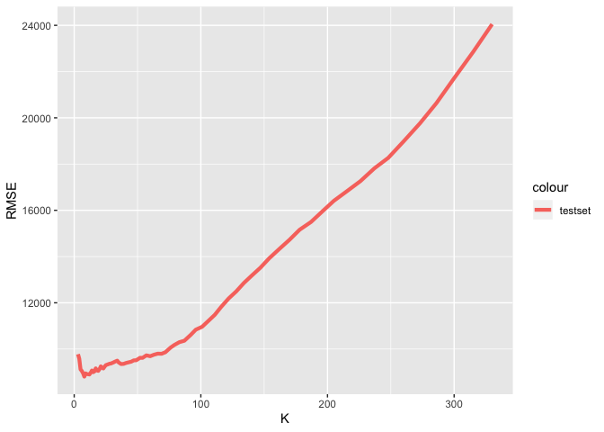
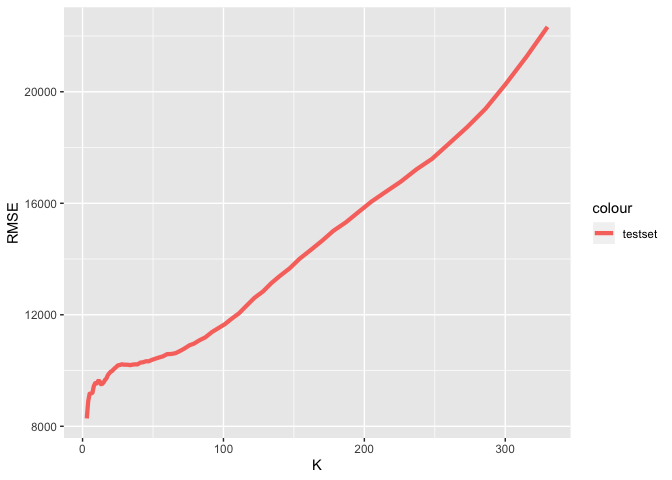
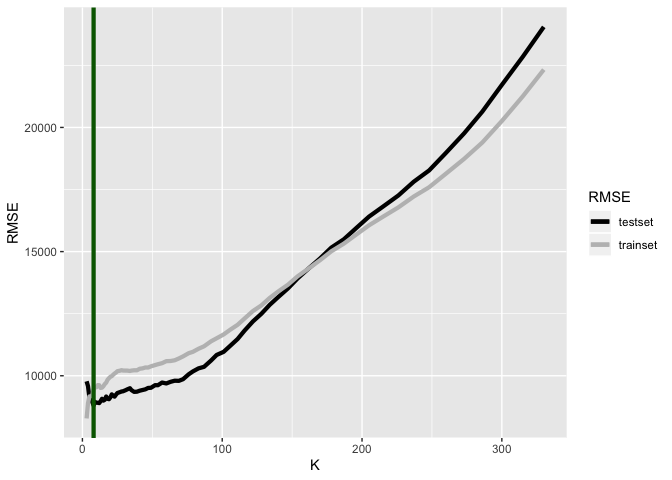
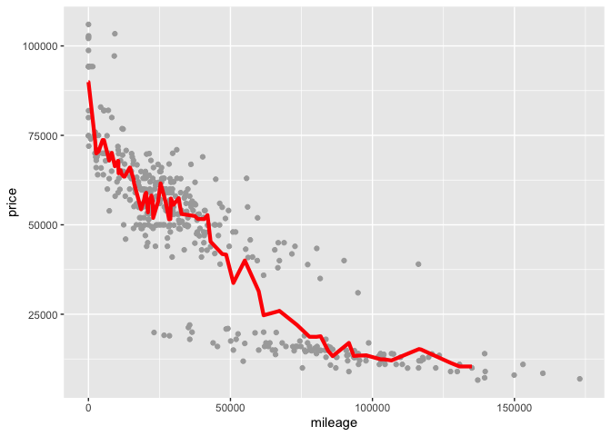
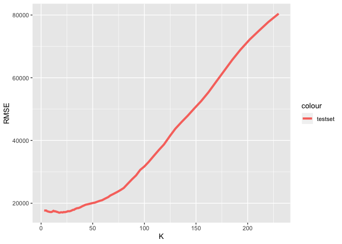
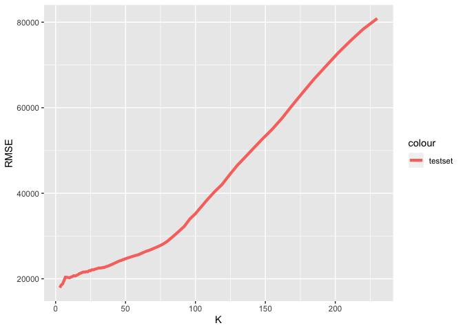
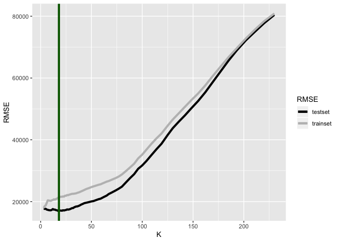

trim level 350
==============

    ## Loading required package: dplyr

    ## 
    ## Attaching package: 'dplyr'

    ## The following objects are masked from 'package:stats':
    ## 
    ##     filter, lag

    ## The following objects are masked from 'package:base':
    ## 
    ##     intersect, setdiff, setequal, union

    ## Loading required package: lattice

    ## Loading required package: ggformula

    ## Loading required package: ggplot2

    ## Loading required package: ggstance

    ## 
    ## Attaching package: 'ggstance'

    ## The following objects are masked from 'package:ggplot2':
    ## 
    ##     geom_errorbarh, GeomErrorbarh

    ## 
    ## New to ggformula?  Try the tutorials: 
    ##  learnr::run_tutorial("introduction", package = "ggformula")
    ##  learnr::run_tutorial("refining", package = "ggformula")

    ## Loading required package: mosaicData

    ## Loading required package: Matrix

    ## Registered S3 method overwritten by 'mosaic':
    ##   method                           from   
    ##   fortify.SpatialPolygonsDataFrame ggplot2

    ## 
    ## The 'mosaic' package masks several functions from core packages in order to add 
    ## additional features.  The original behavior of these functions should not be affected by this.
    ## 
    ## Note: If you use the Matrix package, be sure to load it BEFORE loading mosaic.

    ## 
    ## Attaching package: 'mosaic'

    ## The following object is masked from 'package:Matrix':
    ## 
    ##     mean

    ## The following object is masked from 'package:ggplot2':
    ## 
    ##     stat

    ## The following objects are masked from 'package:dplyr':
    ## 
    ##     count, do, tally

    ## The following objects are masked from 'package:stats':
    ## 
    ##     binom.test, cor, cor.test, cov, fivenum, IQR, median,
    ##     prop.test, quantile, sd, t.test, var

    ## The following objects are masked from 'package:base':
    ## 
    ##     max, mean, min, prod, range, sample, sum

    ## Parsed with column specification:
    ## cols(
    ##   id = col_double(),
    ##   trim = col_character(),
    ##   subTrim = col_character(),
    ##   condition = col_character(),
    ##   isOneOwner = col_logical(),
    ##   mileage = col_double(),
    ##   year = col_double(),
    ##   color = col_character(),
    ##   displacement = col_character(),
    ##   fuel = col_character(),
    ##   state = col_character(),
    ##   region = col_character(),
    ##   soundSystem = col_character(),
    ##   wheelType = col_character(),
    ##   wheelSize = col_character(),
    ##   featureCount = col_double(),
    ##   price = col_double()
    ## )

    ## ── Attaching packages ───────────────────────────────────────────── tidyverse 1.2.1 ──

    ## ✔ tibble  2.1.3     ✔ purrr   0.3.2
    ## ✔ tidyr   0.8.3     ✔ stringr 1.4.0
    ## ✔ tibble  2.1.3     ✔ forcats 0.4.0

    ## ── Conflicts ──────────────────────────────────────────────── tidyverse_conflicts() ──
    ## ✖ mosaic::count()            masks dplyr::count()
    ## ✖ purrr::cross()             masks mosaic::cross()
    ## ✖ mosaic::do()               masks dplyr::do()
    ## ✖ tidyr::expand()            masks Matrix::expand()
    ## ✖ dplyr::filter()            masks stats::filter()
    ## ✖ ggstance::geom_errorbarh() masks ggplot2::geom_errorbarh()
    ## ✖ dplyr::lag()               masks stats::lag()
    ## ✖ mosaic::stat()             masks ggplot2::stat()
    ## ✖ mosaic::tally()            masks dplyr::tally()

    ## 
    ## Attaching package: 'foreach'

    ## The following objects are masked from 'package:purrr':
    ## 
    ##     accumulate, when

trim level 350: out of sample RMSE versus K
===========================================

    ## [1] 8

trim level 350: RMSE versus K
=============================

trim level 350: RMSE(2 types) versus K
======================================

trim level 350: K-nearest neighbors at the optimal K
====================================================

trim level 65AMG
================

trim level 65AMG: out of sample RMSE versus K
=============================================

    ## [1] 18

trim level 65AMG: RMSE versus K
===============================

trim level 65AMG: RMSE(2 types) versus K
========================================

